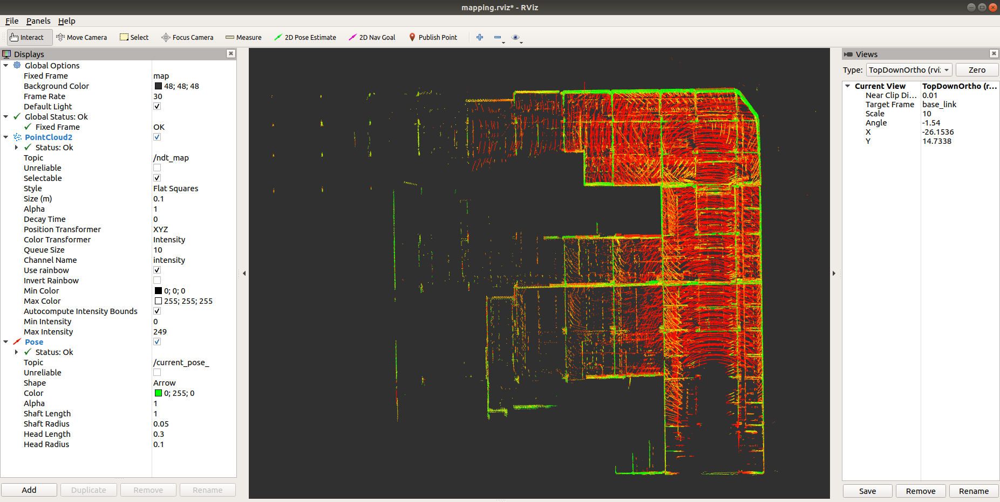

# NDT Mapping




## Environment
* Ubuntu 18.04
* ROS Melodic

## Data
* RosBag for offline testing

## IO
- input  
/points_raw (sensor_msgs::PointCloud2)  
- output  
/ndt_map (sensor_msgs::PointCloud2)  
/curent_pose (geometry_msgs::PoseStamped) 

## How to use
* Move the project into the ROS workspace (e.g. ~/ros_ws/src/)
* Build the project in the ROS workspace
  ```bash
  cd ros_ws/
  catkin_make
  ```
* Setup the configuration in [ndt_mapping.launch](./launch/ndt_mapping.launch)
  * NDT Parameters
    ```xml
    <!-- line 2 -->
    <arg name="max_iter" default="30" doc="max iteration for alignment"/>
    <arg name="step_size" default="0.1" doc="step_size maximum step length[m]"/>
    <arg name="ndt_res" default="5.0" doc="resolution side length of voxels[m]"/>
    <arg name="trans_eps" default="0.01" doc="transform epsilon to stop iteration"/>
    <arg name="voxel_leaf_size" default="2.0" doc="a down sample size of a input cloud[m]"/>
    ```

  * Mapping Parameters
    ```xml
    <!-- line 9 -->
    <arg name="scan_rate" default="10.0" doc="scan_rate"/>
    <arg name="min_scan_range" default="5.0" doc="min_scan_range"/>
    <arg name="max_scan_range" default="200.0" doc="max_scan_range"/>
    <arg name="min_add_scan_shift" default="1.0" doc="a moving distance of a map update[m]"/>
    <arg name="use_imu" default="false" doc="use imu or not"/>
    ```
  
  * Static Transform Parameters
    ```xml
    <!-- line 16 -->
    <arg name="x" default="1.3" doc="static_transform_x localizer_to_base_link"/>
    <arg name="y" default="0.0" doc="static_transform_y localizer_to_base_link"/>
    <arg name="z" default="1.4" doc="static_transform_z localizer_to_base_link"/>
    <arg name="roll" default="0.0" doc="static_transform_roll localizer_to_base_link"/>
    <arg name="pitch" default="0.0" doc="static_transform_pitch localizer_to_base_link"/>
    <arg name="yaw" default="0.0" doc="static_transform_yaw localizer_to_base_link"/>
    ```

* Run the NDT-Mapping
  * Source the setup.bash
    ```bash
    cd ros_ws
    source devel/setup.bash
    ```
  
  * Launch the NDT-Mapping node
    ```bash
    roslaunch ndt_mapping ndt_mapping.launch
    ```

* Play the rosbag for offline testing
  ```bash
  rosbag play offline_testing.bag
  ```

## Acknowledgment

Part of the code refers to the open-sourced project [Autoware](https://github.com/Autoware-AI/autoware.ai)

## Related projects in pure ROS (Melodic) 

* [ROS_NDT_Localizer](https://github.com/leofansq/ROS_NDT_Localizer)
* [ROS_Waypoints_Processor](https://github.com/leofansq/ROS_Waypoints_Processor)
* [ROS_Pure_Pursuit](https://github.com/leofansq/ROS_Pure_Pursuit)
* [ROS_Object_Cluster](https://github.com/leofansq/ROS_Object_Cluster)
